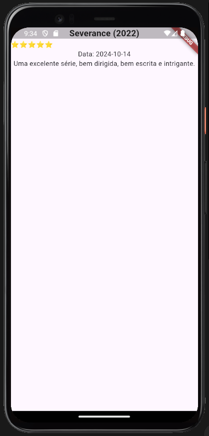

# Atividade

## Boas-vindas à nossa lista de exercícios!

O que é:
Nada de teoria abstrata! Os nossos exercícios colocam você no centro do processo de aprendizado, permitindo que você construa e experimente conceitos de programação e tecnologia. Vamos testar cenários reais do dia a dia de trabalho.

```
A realização das listas não é obrigatória, mas altamente recomendada para que você teste os seus aprendizados.
```

## Para que serve:

Esta lista serve para aprender, reforçar, praticar e aprimorar habilidades em programação.

Cada exercício é uma oportunidade de aplicar conhecimentos teóricos em cenários reais. Desafie-se! A lista prepara você não apenas para entender a tecnologia, mas para utilizá-la com criatividade e eficiência em seus próprios projetos ou no trabalho.

## Como fazer:

1. Leia cada exercício com atenção: comece entendendo o cenário proposto e o que se espera como resultado.
2. Escreva o código: utilize o ambiente de codificação de sua escolha para escrever e testar o seu código (nesta disciplina em específico, recomendamos o VSCode). Não se preocupe em acertar de primeira, a prática leva à perfeição.
3. Repita: a repetição é chave para o aprendizado. Tente fazer os exercícios mais de uma vez, aplicando melhorias e variantes.

Não se esqueça que estamos aqui (issues) para ajudar você!

Bons estudos!

## Exercícios

Nesta lista de exercícios, você vai criar um aplicativo de reviews de filmes e séries. A ideia consiste em entregar uma review diferente sempre que o aplicativo for aberto. Aplique os conhecimentos que já aprendeu nesta aula, aproveitando o fato de que, ao reiniciar a aplicação, a tela é reconstruída.

Siga os exercícios na ordem indicada e, ao final, verifique se sua tela ficou semelhante à imagem abaixo.



Não se esqueça que estamos no Fórum e no Discord para ajudar você!

Bons estudos!

**1. Crie um novo projeto Flutter:**

Utilize o comando aprendido para criar um novo projeto Flutter. Dê o nome que achar mais interessante para o projeto, eu recomendo `flutter_reviews`;

**2. Crie o modelo de “review” e alguns exemplos:**

Crie um arquivo com uma classe do tipo “model” que represente uma review, que os atributos serão:

- Nome (textual);
- Estrelas (inteiro);
- Review (textual);
- Data (datetime);

Depois, crie uma função que, dada uma lista de reviews retorna uma aleatória. Preencha essa lista com filmes e séries do seu interesse! :D

**3. Crie uma tela que receba o modelo “review”:**

Agora chegou a hora de criar nossa tela.

Para isso, siga os passos que você aprendeu em aula até que a tela comporte uma coluna.

```
Lembre-se que essa tela precisa estar preparada para receber uma review pelo seu construtor, portanto, utilize seus conhecimentos de Orientação à Objeto para tal.
```

**4. Crie os elementos na tela de review:**

Agora chegou a hora de criar a tela de review, sempre levando em consideração os atributos do objeto `Review` recebido:

- Na coluna, comece construindo um texto com o título. Ele deverá mostrar além do nome do filme ou série, o ano entre parênteses.
  - Decore esse texto usando o atributo style que recebe um TextStyle de Text para que ele tenha tamanho 18 e peso negrito.
- Para criar a linha com várias estrelas, você utilizará uma Row, que é um widget idêntico ao Column só que, ao invés de agrupar seus filhos na vertical, agrupa na horizontal;
  - Utilize também seu conhecimento dos métodos de List para gerar uma lista de widgets que será passada para o `children` de `Row`;
- Finalizando as informações à serem mostradas sobre a review, adicione textos para a data e para a própria review.
  - Formate e estilize como achar interessante, para a data, recomendo pegar apenas os 10 primeiros caracteres para evitar a informação de hora.

**5. Configure a `main` para mostrar uma review**

Por fim, na tela inicial, crie um `ReviewApp` que inicializa a aplicação e chama a `ReviewScreen`. Utilize a função que devolve uma review aleatória para decidir a review da inicialização atual.

Bons estudos. Bora!
