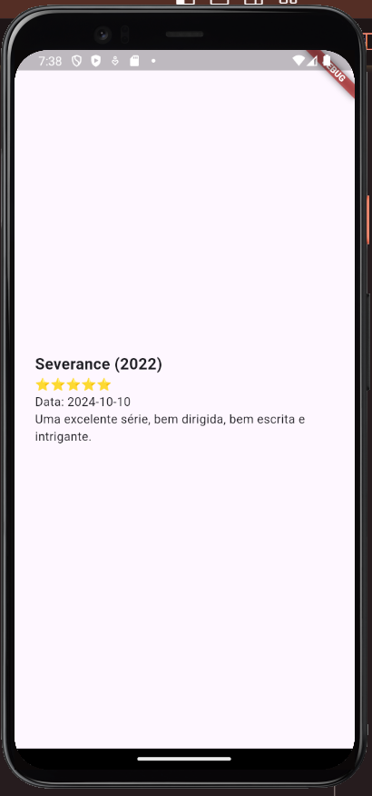

# Desafio

## Desafio: melhorando app de reviews

Nessa aula, aprendemos sobre os widgets agregadores, que permitem agrupar e organizar outros widgets de maneira eficiente.

Com base nesse novo conhecimento, que tal um desafio? Você topa?

Se você fez toda a lista de exercícios da aula 1, deve ter percebido que o projeto não ficou super alinhado e precisa de alguns ajustes. Que tal fazer essa organização agora que já tem os conhecimentos necessários sobre estilizações e alinhamentos?

Vou te deixar algumas dicas:

- Defina bem como usar o MainAxisAlignment e o CrossAxisAlignment. Não tenha medo de testar as diversas possibilidades até chegar no resultado esperado;
- Confira a [documentação oficial do Flutter](https://docs.flutter.dev/ui/widgets/layout "Documentação Oficial") sempre que necessário;
- Utilize o design a seguir para tentar obter um resultado similar na sua aplicação:

Recomendo que esse, ou qualquer desafio, seja executado em uma branch específica (ou nesse caso, em um projeto à parte) para não comprometer o andamento do curso.

Boa sorte!
